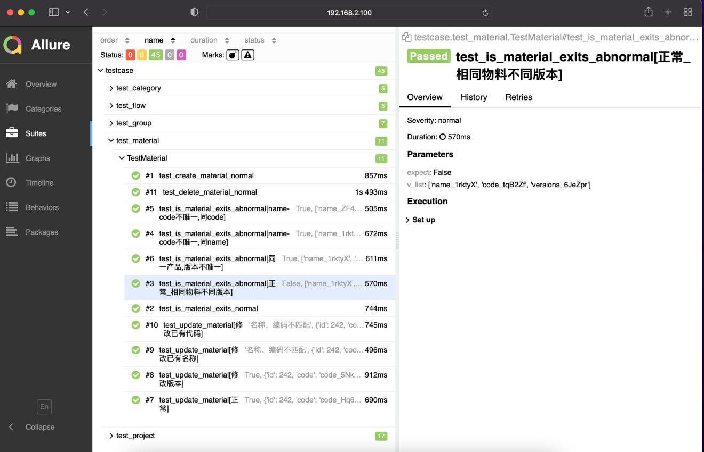

<!-- TABLE OF CONTENTS -->
<details>
  <summary>目录</summary>
  <ol>
    <li><a href="#如何使用">如何使用</a></li>
    <li>
      <a href="#项目介绍">项目介绍</a>
      <ul>
        <li><a href="#公司项目背景">公司项目背景</a></li>
        <li><a href="#技术选型">技术选型</a></li>
        <li><a href="#实现细节">实现细节</a></li>
      </ul>
    </li>
    <li><a href="#效果展示">效果展示</a></li>
  </ol>
</details>

<!-- HOW TO USE -->

## 如何使用

**0.安装依赖库**

```shell
pip install -r requirements.txt
```

**1. 根据schema快速生成graphql接口**

```
python \
    -m sgqlc.introspection \
    --exclude-deprecated \
    --exclude-description \
    https://your_url/graphql/ \
    platform_schema.json || exit 1
sgqlc-codegen schema platform_schema.json platform_schema.py;
```

ps: 如果报错无法识别https，安装证书也许可以解决

```
bash /Applications/Python*/Install\ Certificates.command
```

**2. 进入测试用例目录执行用例**

```shell
cd testcase
pytest -vs # 或使用其他需要的命令行参数
```

ps: 如果报错无法识别https，安装证书也许可以解决


<!-- ABOUT THE PROJECT -->

## 项目介绍

本项目为我司工业互联网SaaS平台中plm项目（产品生命周期）的接口自动化测试项目。采用Python + pytest + sgqlc 技术栈完成。

### 公司项目背景

公司后端技术采取的是 [GraphQL](https://graphql.org/) 来定义接口。每次项目开发之后，后端开发会先给出一份schema，前端根据这份schema去了解数据定义，schema先行，前端根据这份schema也有自己的mock技术，前后端并行开发。
采取微服务方式部署，GraphQL网关会把所有的微服务集合起来，暴露一个地址给前端调用。
一个GraphQL定义的请求体大致形如：
```json
{
  "operationName": "typeCompanies",
  "variables": {
    "filter": {
      "search": ""
    },
    "scenario": "COMPANY"
  },
  "query": "query typeCompanies($filter: CompanyFilter, $scenario: TypeCompaniesScenario) {\n  typeCompanies(filter: $filter, scenario: $scenario) {\n    data {\n      type {\n        id\n        name\n        __typename\n      }\n      companies {\n        ...companyFields\n        __typename\n      }\n      __typename\n    }\n    totalCount\n    __typename\n  }\n}\n\nfragment companyFields on Company {\n  id\n  name\n  county\n  address\n  uscc\n  contact\n  email\n  phone\n  province\n  city\n  type {\n    id\n    name\n    __typename\n  }\n  isMine\n  __typename\n}\n"
}
```
在query中，graphql定义了要传入的参数，和返回的值，其中返回的值可以进行按需查询。

### 技术选型

首先选用Python + pytest框架（技术较新，社区活跃，插件丰富），保证编程的简单，可以专注于测试用例设计与测试数据设计。然后通过调研，选用[sgqlc](https://github.com/profusion/sgqlc) 第三方库来替代传统的requests库，与GraphQL较好的契合。
并通过向该库作者咨询，解决了难以通过代理调试接口的问题。

### 实现细节

```apis```包封装业务接口，其中```base_api.py```文件封装一些公共方法。\
```utils```包内含一些工具类：mock数据、读取环境数据、DB访问、代理开关。\
```case_data```包内含测试数据的模版、及一些构建方法。有别于传统的写死在```json```文件的测试数据，采用将测试数据模版用```YAML```文件格式保存，然后通过修改模版测试数据的方式写具体的方法，来实现动态参数的硬性需求。\
```test_case```包内含测试用例方法，其中灵活使用```parametrize/fixture```等装饰器实现用例参数化、前后置操作及其他具体需求。\
```conftest.py```文件内含一些hook函数实现将收集的测试用例items的name和node_id的中文显示。\
另，```dev_log.md```是开发过程中记录一些思考过程和点子。

## 效果展示

主要结合allure以测试报告网页的形式输出，这里截图如下：

